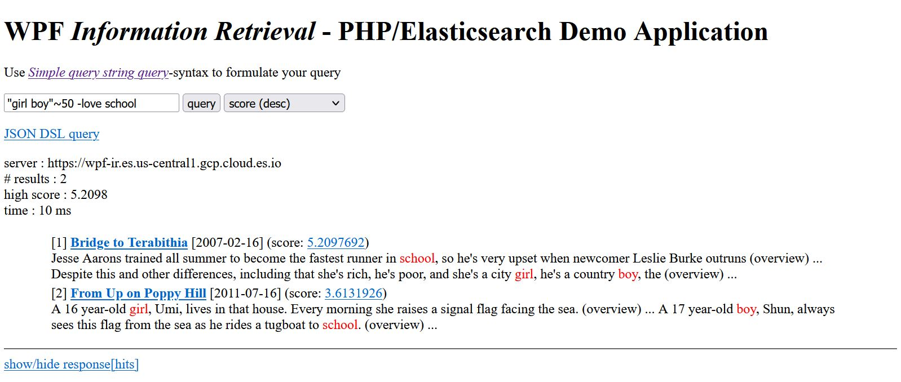

# PHP/Elasticsearch Demo Application



Sample web-application that shows the usage of the php/elasticsearch library. 

The application uses the [Simple query string syntax](https://www.elastic.co/guide/en/elasticsearch/reference/current/query-dsl-simple-query-string-query.html#simple-query-string-syntax) to query the database.

The application also demonstrates the [highlight](https://www.elastic.co/guide/en/elasticsearch/reference/current/highlighting.html) and the [explain](https://www.elastic.co/guide/en/elasticsearch/reference/current/search-explain.html) functionality (by klicking the score value).

## Demo (without installing Elasticsearch, without data import)

- open the file ````web/php-demo.ini```` and set the server, username and password properties

### <a name="apache_config">Apache configuration (xampp)</a>:

- Add the following lines at the end of file ````xampp/apache/conf/http.conf```` 
  (replace ````c:/users/demo/documents/elasticsearch-php/web```` 
  with your actual path): 

````
Alias /IR c:/users/demo/documents/elasticsearch-php/web
<Directory "c:/users/demo/documents/elasticsearch-php/web">
    AllowOverride All
    Options None
    Require all granted
</Directory>
````

This create an alias (here IR), which links to the subdirectory ````web```` 
(here: ````c:/users/demo/documents/elasticsearch-php/web````). 
After that, you have to restart the apache web-server.

- try [http://localhost/IR](http://localhost/IR) ...

 
## With local Elasticsearch server (requires installation of Elasticsearch, data import)

### Installation:

- Install [Elasticsearch](https://www.elastic.co/de/downloads/elasticsearch) 

### Configuration Elasticsearch

- Disable user authentication
file ````./config/elasticsearch.yml````
````
...
# Enable security features
xpack.security.enabled: false
...
````
### Import data into Elasticsearch
- Create Elasticsearch index & import example data
````
curl.exe -XDELETE http://localhost:9200/tmdb
curl -f  -H 'Content-Type: application/json' -XPUT http://localhost:9200/tmdb -d '  { "settings": { "number_of_shards" : "1", "number_of_replicas" : "0" } }'
curl -f -X PUT http://localhost:9200/tmdb/_bulk -H"Content-type: application/json" --data-binary @tmdb-bulk.json
````

###  Apache configuration:

see "[Apache configuration (xampp)](#apache_conf)" above

### Usage:

(Re)start your apache webserver and load the url [http://localhost:9200/IR](http://localhost:9200/IR).

